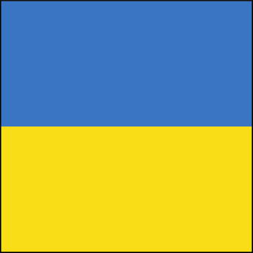

<!--
*** Thanks for checking out the Best-README-Template. If you have a suggestion
*** that would make this better, please fork the repo and create a pull request
*** or simply open an issue with the tag "enhancement".
*** Don't forget to give the project a star!
*** Thanks again! Now go create something AMAZING! :D
-->

<!-- PROJECT SHIELDS -->
<!--
*** I'm using markdown "reference style" links for readability.
*** Reference links are enclosed in brackets [ ] instead of parentheses ( ).
*** See the bottom of this document for the declaration of the reference variables
*** for contributors-url, forks-url, etc. This is an optional, concise syntax you may use.
*** https://www.markdownguide.org/basic-syntax/#reference-style-links
-->
[![Contributors][contributors-shield]][contributors-url]
[![Forks][forks-shield]][forks-url]
[![Stargazers][stars-shield]][stars-url]
[![Issues][issues-shield]][issues-url]
[![MIT License][license-shield]][license-url]
[![LinkedIn][linkedin-shield]][linkedin-url]

<!-- PROJECT LOGO -->
 

  

  <h3 align="center">War in Ukraine - Twitter analysis</h3>

  

    Natural Language Processing with Twitter data
     
    <a href="https://github.com/janskwr/Russia-Ukraine-Twitter-Analysis"><strong>Explore the docs »</strong></a>
     
     
    <a href="https://github.com/janskwr/Russia-Ukraine-Twitter-Analysis">View Demo</a>
    ·
    <a href="https://github.com/janskwr/Russia-Ukraine-Twitter-Analysis/issues">Report Bug</a>
    ·
    <a href="https://github.com/janskwr/Russia-Ukraine-Twitter-Analysis/issues">Request Feature</a>
  

<!-- TABLE OF CONTENTS -->

  
Table of Contents

  <ol>
    <li>
      <a href="#about-the-project">About The Project</a>
    </li>
    <li><a href="#requirements">Requirements</a></li>
    <li><a href="#usage">Usage</a></li>
    <li><a href="#contributing">Contributing</a></li>
    <li><a href="#license">License</a></li>
    <li><a href="#contact">Contact</a></li>

  </ol>

<!-- ABOUT THE PROJECT -->
## About The Project

[![EDA Screen Shot][product-screenshot]](https://www.youtube.com/watch?v=-KQpq4-2Qdk)

This repository contains advanced NLP analysis of tweets written during the first week of Russian invasion of Ukraine. We scraped over 10 million tweets from the first week of Russian invasion (check our data directory) and performed advanced topic modelling on them using BERTopic. We also developed an interactive application with Streamlit with some cool visualizations. 

(<a href="#top">back to top</a>)

## Requirements

This section lists some major frameworks/libraries used in our project. You don't have to download them if you want to use our Streamlit app.

* [spaCy](https://spacy.io/)
* [BERTopic](https://maartengr.github.io/BERTopic/index.html)
* [NumPy](https://numpy.org/)
* [pandas](https://pandas.pydata.org/)
* [Streamlit](https://streamlit.io/)

(<a href="#top">back to top</a>)

<!-- USAGE EXAMPLES -->
## Usage

To use our app, please click on [this](https://www.youtube.com/watch?v=-KQpq4-2Qdk) link!

_For more examples, please refer to the [Presentation](https://github.com/janskwr/Russia-Ukraine-Twitter-Analysis/blob/master/reports/8_4_WarInUkraine-TwitterAnalysis.mp4)_

(<a href="#top">back to top</a>)

<!-- CONTRIBUTING -->
## Contributing

Contributions are what make the open source community such an amazing place to learn, inspire, and create. Any contributions you make are **greatly appreciated**.

If you have a suggestion that would make this better, please fork the repo and create a pull request. You can also simply open an issue with the tag "enhancement".
Don't forget to give the project a star! Thanks again!

1. Fork the Project
2. Create your Feature Branch (`git checkout -b feature/AmazingFeature`)
3. Commit your Changes (`git commit -m 'Add some AmazingFeature'`)
4. Push to the Branch (`git push origin feature/AmazingFeature`)
5. Open a Pull Request

(<a href="#top">back to top</a>)

<!-- LICENSE -->
## License

Distributed under the GNU General Public License v3.0. See `LICENSE.txt` for more information.

## Authors

* [Jan Skwarek](https://github.com/janskwr)
* [Jakub Kozieł](https://github.com/jakubkoziel)
* [Tomasz Nocoń](https://www.youtube.com/watch?v=-KQpq4-2Qdk)

(<a href="#top">back to top</a>)

<!-- CONTACT -->
## Contact
* Jan Skwarek - janskwarek@protonmail.ch - [Instagram](https://www.instagram.com/janskwr/) - [Facebook](https://www.facebook.com/jan.skwarek) - [LinkedIn](https://www.linkedin.com/in/jan-skwarek-87b01419b/)
* Jakub Kozieł
* Tomasz Nocoń

Project Link: [https://github.com/janskwr/Russia-Ukraine-Twitter-Analysis](https://github.com/janskwr/Russia-Ukraine-Twitter-Analysis)

(<a href="#top">back to top</a>)

<!-- MARKDOWN LINKS & IMAGES -->
<!-- https://www.markdownguide.org/basic-syntax/#reference-style-links -->
[contributors-shield]: https://img.shields.io/github/contributors/janskwr/Russia-Ukraine-Twitter-Analysis.svg?style=for-the-badge
[contributors-url]: https://github.com/janskwr/Russia-Ukraine-Twitter-Analysis/graphs/contributors
[forks-shield]: https://img.shields.io/github/forks/janskwr/Russia-Ukraine-Twitter-Analysis.svg?style=for-the-badge
[forks-url]: https://github.com/janskwr/Russia-Ukraine-Twitter-Analysis/network/members
[stars-shield]: https://img.shields.io/github/stars/janskwr/Russia-Ukraine-Twitter-Analysis.svg?style=for-the-badge
[stars-url]: https://github.com/janskwr/Russia-Ukraine-Twitter-Analysis/stargazers
[issues-shield]: https://img.shields.io/github/issues/janskwr/Russia-Ukraine-Twitter-Analysis.svg?style=for-the-badge
[issues-url]: https://github.com/janskwr/Russia-Ukraine-Twitter-Analysis/issues
[license-shield]: https://img.shields.io/github/license/janskwr/Russia-Ukraine-Twitter-Analysis.svg?style=for-the-badge
[license-url]: https://github.com/janskwr/Russia-Ukraine-Twitter-Analysis/blob/master/LICENSE.txt
[linkedin-shield]: https://img.shields.io/badge/-LinkedIn-black.svg?style=for-the-badge&logo=linkedin&colorB=555
[linkedin-url]: https://www.linkedin.com/in/jan-skwarek-87b01419b/
[product-screenshot]: reports/figures/eda1.png
